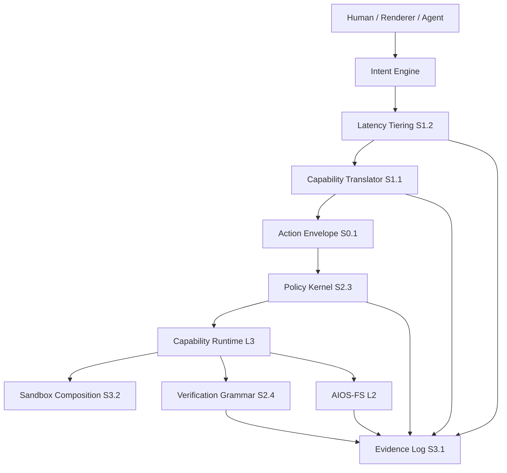

# Architecture Overview — Rev.2

Status: `PARTIAL`

Rev.2 turns the Rev.1 vision into an agent-readable contract stack. The key shift is that cognition, policy, execution, verification, storage, and evidence are separated by typed boundaries.

## High-level flow



## Layer dependency rule

A layer may depend on its own layer and lower-numbered layers. A layer must not require a higher-numbered layer for correctness.

This protects boot, recovery, filesystem truth, and policy from UI or cognitive failure.

## Contract map

| Contract                     | Owner | Main consumers             |
| ---------------------------- | ----- | -------------------------- |
| Action Envelope + Lifecycle  | XX    | L3, L4, L5, L9             |
| Capability Translator        | L5    | L5 planner, L3 runtime     |
| Latency Tiering              | L5    | renderers, Intent Engine   |
| AIOS-FS Object Model         | L2    | L3, L5, L6, L9             |
| AIOS-FS Conflict Resolution  | L2    | L3, L5, L7                 |
| Query/View Language          | L2    | L5, L7                     |
| Policy Kernel                | L4    | L3, L5, L7                 |
| Verification Grammar         | L9    | L3, L5, adapters           |
| Evidence Log                 | L9    | all layers                 |
| Sandbox Composition          | L6    | L3, L4, compatibility runtimes |

## Execution boundary

```text
L5 may propose.
L4 may allow, require approval, or deny.
L3 may execute through adapters.
L9 records what happened.
L2 stores durable object truth.
```

The AI model is never the execution boundary.

## Root and sandbox boundary

| Component                    | Privilege expectation                         |
| ---------------------------- | --------------------------------------------- |
| Cognitive Core               | user/service account, no raw secret access    |
| Capability Translator        | no privileged execution                       |
| Policy Kernel                | protected service, append-only evidence link  |
| Capability Runtime           | privileged broker with minimal adapter scopes |
| Adapter process              | sandboxed, least privilege                    |
| AIOS-FS object store         | protected storage service                     |
| Renderer                     | user session privilege                        |
| Recovery tools               | root/recovery island, no external AI required |

## Linux integration map

| Linux facility       | AIOS role                                      |
| -------------------- | ---------------------------------------------- |
| systemd/OpenRC       | adapter backend for service capabilities       |
| package managers     | adapter backend for package capabilities       |
| namespaces/cgroups   | sandbox enforcement                            |
| seccomp/Landlock/MAC | sandbox hardening                              |
| FUSE/portals         | AIOS-FS and app access projections             |
| OpenTelemetry        | trace context and telemetry export             |
| eBPF                 | observability and runtime probes               |

Rev.2 does not require a custom Linux kernel module for correctness.
