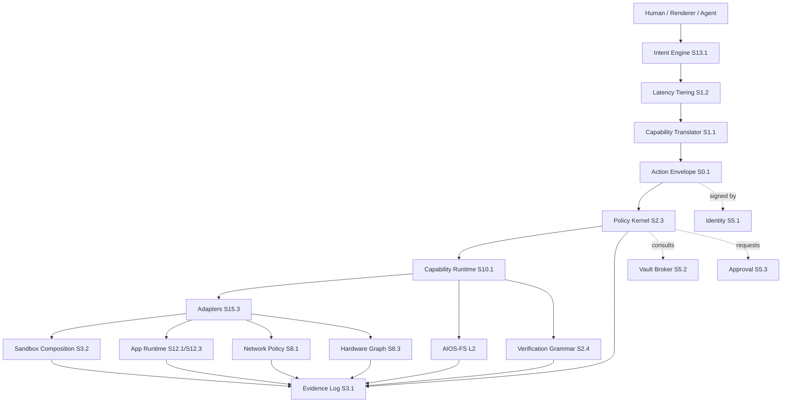

# Architecture Overview — Rev.2

Status: `PARTIAL` (all 11 layers carry contract-grade sub-specs; whole-system promotion to `REAL` blocks on Tier 5 audit + simulation)

AIOS is an **AI-native Linux distribution**. Linux remains the trusted execution substrate (kernel, drivers, scheduler, syscalls); the AIOS layer is what makes the distribution AI-native — cognition, policy, evidence, and AIOS-FS are real distribution components, not an assistant bolted on.

Rev.2 turns the Rev.1 vision into an agent-readable contract stack. The key shift is that cognition, policy, execution, verification, storage, and evidence are separated by typed boundaries — and every boundary is mechanically enforced by closed-vocabulary rejection codes that produce permanent forensic evidence on bypass.

## High-level flow



## Layer dependency rule

A layer may depend on its own layer and lower-numbered layers. A layer must not require a higher-numbered layer for correctness.

This protects boot, recovery, filesystem truth, and policy from UI or cognitive failure. The corollary is constitutional:

- **L1 recovery does not depend on L5 cognition.** First-boot (S9.2) and recovery boundary (S9.1) initialise via signed bundles, not via LLM proposals.
- **L0 invariants do not depend on L5/L7 surfaces.** The 24-entry INV catalog is signed material loaded at boot.
- **L4 policy decisions do not depend on L5 cognition.** Approval (S5.3) and emergency override (S5.4) are operator-driven.

## Layer dependency discipline (refined)

The "lower depends on, never on, higher" rule is unconditional for **runtime correctness**. Any layer must boot, recover, and fail-safe without higher-numbered layers operational. But the rule does NOT forbid **vocabulary sharing** between layers — closed enums, schema shapes, canonical id formats, and protocol-buffer message types can flow upward in the layer model as type imports without constituting a runtime dependency.

Two distinct relationship classes:

1. **`Requires-for-correctness`**: layer N's contract reads "without layer M operational, layer N cannot fulfil its contract." This is forbidden when M > N. Examples: L1 recovery cannot require L5 cognition operational; L0 governance cannot require L9 evidence log running. (Rule violations.)

2. **`Imports-vocabulary-from`**: layer N's contract reads "layer N's payloads/IDs/enums are co-defined with layer M." This is permitted regardless of layer ordering, because vocabulary is type-level, not runtime-level. Examples: L0 evidence receipt schema imports the `RecordType` closed enum (owned by L9); L2 namespace layout imports subject identity format (owned by L4); L1 first-boot evidence uses the same evidence-receipt schema. The vocabulary import does not make L0/L2/L1 require L9/L4 operational.

Each sub-spec's `Consumes` header MUST distinguish these two:

- `Imports vocabulary from S<X.Y>: <closed enum / schema shape>` — type-level
- `Requires for correctness S<X.Y>: <runtime dependency>` — runtime-level

A `Requires-for-correctness` reference to a higher-numbered layer is an **architectural defect** and must be reframed as either:

(a) a vocabulary import (if the dependency is type-level only), or

(b) a relocated capability (if the dependency is genuinely runtime-level and the vocabulary belongs to a different layer than is currently declared).

The Tier 5 ARCH audit found ~25 `Consumes` declarations that mix the two; Wave 11 (W11-A) reclassified the explicit cases on a defined set of files. Wave 12 (W12) extended the discipline to S11.1 to reciprocate the L8 bilateral inversion. Wave 12+ should sweep the remaining specs.

#### Discipline audit — `Consumes` header refinement coverage

The table below maps each contract-grade sub-spec to whether its `Consumes` header has been split into the explicit `Imports vocabulary from` / `Requires for correctness` buckets. Y = refined; N = unrefined (still mixed). The 16 W11-A targets plus the W12 S11.1 addition are listed Y; the rest remain N pending sweep.

| Spec   | File                                            | Header refined |
| ------ | ----------------------------------------------- | -------------- |
| S6.3   | `L0/03_evidence_receipt_schema.md`              | Y (W11-A)      |
| S9.1   | `L1/01_recovery_boundary.md`                    | Y (W11-A)      |
| S9.2   | `L1/02_first_boot_flow.md`                      | Y (W11-A)      |
| S9.3   | `L1/03_dedicated_kernel_pipeline.md`            | Y (W11-A)      |
| S1.3   | `L2/01_object_model.md`                         | Y (W11-A)      |
| S1.3.b | `L2/03_conflict_resolution.md`                  | Y (W11-A)      |
| S4.1   | `L2/05_namespace_layout.md`                     | Y (W11-A)      |
| S10.1  | `L3/03_capability_runtime_grpc.md`              | Y (W11-A)      |
| S2.3   | `L4/01_policy_kernel.md`                        | Y (W11-A)      |
| S13.1  | `L5/01_cognitive_core_model.md`                 | Y (W11-A)      |
| S1.1   | `L5/02_capability_translator.md`                | Y (W11-A)      |
| S14.1  | `L7/01_surface_composition.md`                  | Y (W11-A)      |
| S14.4  | `L7/04_kde_renderer.md`                         | Y (W11-A)      |
| S14.5  | `L7/05_web_renderer.md`                         | Y (W11-A)      |
| S8.3   | `L8/01_hardware_graph.md`                       | Y (W11-A)      |
| S8.5   | `L8/04_firmware_trust.md`                       | Y (W11-A)      |
| S11.1  | `L10/01_repository_model.md`                    | Y (W12)        |
| S6.1   | `L0/01_status_taxonomy.md`                      | N              |
| S6.2   | `L0/02_evidence_grades.md`                      | N              |
| S6.4   | `L0/04_invariants.md`                           | N              |
| S2.1   | `L2/02_query_view_language.md`                  | N              |
| S2.2   | `L2/04_implementation_space.md`                 | N              |
| S15.1  | `L3/01_unit_manifest.md`                        | N              |
| S15.2  | `L3/02_state_transitions.md`                    | N              |
| S15.3  | `L3/04_adapter_model.md`                        | N              |
| S5.1   | `L4/03_identity_model.md`                       | N              |
| S5.2   | `L4/02_vault_broker.md`                         | N              |
| S5.3   | `L4/04_approval_mechanics.md`                   | N              |
| S5.4   | `L4/05_emergency_override.md`                   | N              |
| S1.2   | `L5/03_latency_tiering.md`                      | N              |
| S13.2  | `L5/05_model_router.md`                         | N              |
| S3.2   | `XX/sandbox composition` (per sub-spec home)    | N              |
| S0.1   | `XX/01_action_envelope_lifecycle.md`            | N              |
| S0.3   | `XX/03_mvp_golden_path.md`                      | N              |
| S0.4   | `XX/04_constitutional_meta_principles.md`       | N              |
| S3.1   | `L9/01_evidence_log.md`                         | N              |
| S2.4   | (S2.4 verification grammar — per sub-spec home) | N              |
| S8.1   | `L8/02_network_policy.md`                       | N              |
| S8.4   | `L8/03_dns_vpn_management.md`                   | N              |
| S12.1  | `L6/01_app_runtime_model.md`                    | N              |
| S14.2  | `L7/02_chrome_zone.md`                          | N              |
| S14.3  | `L7/03_visual_identity.md`                      | N              |

(N rows are candidate scope for W12+ sweep; Y rows are evidence-supported by `grep -l "Imports vocabulary from\\|Requires for correctness"` over the spec tree.)

> Footnote: This refinement does not promote any new INV. It clarifies the existing INV-007 (Layer Downward Dependency) per its operational interpretation.

## Contract map

Active contract-grade sub-specs (~30 across 11 layers + cross-cutting). All carry `CONTRACT` status; promotion to `REAL` is per-layer and blocks on E2+ implementation evidence.

### Cross-cutting (XX)

| Phase | Contract                       | File                                      | Main consumers         |
| ----- | ------------------------------ | ----------------------------------------- | ---------------------- |
| S0.1  | Action Envelope + Lifecycle    | `XX/01_action_envelope_lifecycle.md`      | L3, L4, L5, L9         |
| S0.3  | MVP Golden Path Contract       | `XX/03_mvp_golden_path.md`                | all layers (E2 trace)  |
| S0.4  | Constitutional Meta-Principles | `XX/04_constitutional_meta_principles.md` | auditors, contributors |
| R1    | ProxGuard Reference Note       | `XX/02_proxguard_reference_model.md`      | L3, L4, L6, L8, L9     |

### L0 — Governance, Evidence, Safety

| Phase | Contract                  | File                                | Main consumers     |
| ----- | ------------------------- | ----------------------------------- | ------------------ |
| S6.1  | Status Taxonomy           | `L0/01_status_taxonomy.md`          | all layers         |
| S6.2  | Evidence Grades (E0–E5)   | `L0/02_evidence_grades.md`          | all layers         |
| S6.3  | Evidence Receipt Schema   | `L0/03_evidence_receipt_schema.md`  | L9.1 + all writers |
| S6.4  | Constitutional Invariants | `L0/04_invariants.md` (INV-001..24) | all layers         |

### L1 — Kernel, Bootstrap, Recovery

| Phase | Contract                  | File                                 | Main consumers |
| ----- | ------------------------- | ------------------------------------ | -------------- |
| S9.1  | Recovery Boundary         | `L1/01_recovery_boundary.md`         | L0, L4, L9     |
| S9.2  | First-Boot Flow           | `L1/02_first_boot_flow.md`           | L0, L4, L9     |
| S9.3  | Dedicated Kernel Pipeline | `L1/03_dedicated_kernel_pipeline.md` | L3, L8, L9     |

### L2 — AIOS-FS

| Phase | Contract                           | File                                                 |
| ----- | ---------------------------------- | ---------------------------------------------------- |
| S1.3  | Object Model + Conflict Resolution | `L2/01_object_model.md`, `03_conflict_resolution.md` |
| S2.1  | Query / View Language              | `L2/02_query_view_language.md`                       |
| S2.2  | Implementation Space               | `L2/04_implementation_space.md`                      |
| S4.1  | Namespace Layout                   | `L2/05_namespace_layout.md`                          |

### L3 — AIOS-SGR (Service Graph Runtime)

| Phase | Contract                        | File                               |
| ----- | ------------------------------- | ---------------------------------- |
| S15.1 | Unit Manifest                   | `L3/01_unit_manifest.md`           |
| S15.2 | State Transitions (graph + A/B) | `L3/02_state_transitions.md`       |
| S10.1 | Capability Runtime gRPC         | `L3/03_capability_runtime_grpc.md` |
| S15.3 | Adapter Model                   | `L3/04_adapter_model.md`           |

### L4 — Policy, Identity, Vault

| Phase | Contract           | File                          |
| ----- | ------------------ | ----------------------------- |
| S2.3  | Policy Kernel      | `L4/01_policy_kernel.md`      |
| S5.2  | Vault Broker       | `L4/02_vault_broker.md`       |
| S5.1  | Identity Model     | `L4/03_identity_model.md`     |
| S5.3  | Approval Mechanics | `L4/04_approval_mechanics.md` |
| S5.4  | Emergency Override | `L4/05_emergency_override.md` |

### L5 — Cognitive Core

| Phase | Contract                                        | File                             |
| ----- | ----------------------------------------------- | -------------------------------- |
| S13.1 | Cognitive Core Model (intent + memory + agents) | `L5/01_cognitive_core_model.md`  |
| S1.1  | Capability Translator                           | `L5/02_capability_translator.md` |
| S1.2  | Latency Tiering                                 | `L5/03_latency_tiering.md`       |
| S13.2 | Model Router                                    | `L5/05_model_router.md`          |

### L6 — Apps, Packages, Compatibility

| Phase | Contract                                          | File                               |
| ----- | ------------------------------------------------- | ---------------------------------- |
| S12.1 | App Runtime Model + Cross-Ecosystem Compatibility | `L6/01_app_runtime_model.md`       |
| S12.2 | Package Object Model                              | `L6/02_package_model.md`           |
| S12.3 | Compatibility Runtime Orchestration               | `L6/03_compatibility_runtime.md`   |
| S3.2  | Sandbox Composition Language                      | `L6/04_sandbox_composition.md`     |
| S12.4 | Compatibility Knowledge (per-app profiles)        | `L6/05_compatibility_knowledge.md` |

### L7 — Interaction Renderers

| Phase | Contract                    | File                           |
| ----- | --------------------------- | ------------------------------ |
| S7.1  | Surface + Composition Model | `L7/01_surface_composition.md` |
| S7.2  | Shared UI Schema            | `L7/02_shared_ui_schema.md`    |
| S7.3  | Visual Language             | `L7/03_visual_language.md`     |
| S7.4  | KDE Plasma Renderer         | `L7/04_kde_renderer.md`        |
| S7.5  | Web Renderer                | `L7/05_web_renderer.md`        |
| S7.6  | CLI Renderer                | `L7/06_cli_renderer.md`        |

### L8 — Network, Hardware, Devices

| Phase | Contract             | File                          |
| ----- | -------------------- | ----------------------------- |
| S8.3  | Hardware Graph       | `L8/01_hardware_graph.md`     |
| S8.1  | Network Policy       | `L8/02_network_policy.md`     |
| S8.4  | DNS / VPN Management | `L8/03_dns_vpn_management.md` |
| S8.5  | Firmware Trust       | `L8/04_firmware_trust.md`     |
| S8.2  | GPU Resource Model   | `L8/05_gpu_resource_model.md` |

### L9 — Observability, Admin, Operations

| Phase | Contract                         | File                            |
| ----- | -------------------------------- | ------------------------------- |
| S3.1  | Evidence Log Architecture        | `L9/01_evidence_log.md`         |
| S2.4  | Verification Grammar             | `L9/02_verification_grammar.md` |
| S14.1 | Failure Handling and Degradation | `L9/03_failure_handling.md`     |
| S14.2 | Telemetry Pipeline               | `L9/04_telemetry_pipeline.md`   |

### L10 — Distribution, Ecosystem, Marketplace

| Phase | Contract                       | File                              |
| ----- | ------------------------------ | --------------------------------- |
| S11.1 | Repository Model + Trust Roots | `L10/01_repository_model.md`      |
| S11.2 | Marketplace UX                 | `L10/02_marketplace.md`           |
| S11.3 | External Integrations          | `L10/03_external_integrations.md` |

## Execution boundary

```text
L5 may propose.            (S13.1 cognitive FSM cannot transition to EXECUTE)
L4 may allow / approve / deny. (S2.3 Policy Kernel; S5.3 approval; S5.4 override)
L3 may execute through adapters. (S10.1 runtime, S15.3 adapter contract, S15.1 unit manifest)
L9 records what happened.  (S3.1 evidence log, S6.3 receipt schema, S14.2 telemetry)
L2 stores durable object truth. (S1.3 object model, S2.1 query, S2.2 implementation, S4.1 namespace)
L0 enforces invariants.    (S6.4 INV-001..024 catalog)
L1 recovers when above fails. (S9.1 boundary, S9.2 first-boot, S9.3 kernel pipeline)
```

The AI model is never the execution boundary. INV-002 ("AI proposes, never executes") is mechanically enforced at six distinct sites — see `XX/04_constitutional_meta_principles.md §4` for the enforcement map.

## Root and sandbox boundary

| Component                    | Privilege expectation                                                   |
| ---------------------------- | ----------------------------------------------------------------------- |
| Cognitive Core (L5)          | user/service account, no raw secret access, no direct FS write          |
| Capability Translator (S1.1) | no privileged execution; pure mapping                                   |
| Policy Kernel (S2.3)         | protected service; append-only evidence link                            |
| Capability Runtime (S10.1)   | privileged broker with minimal adapter scopes; queue-fairness enforced  |
| Adapter process (S15.3)      | sandboxed (S3.2 composition); least privilege; manifested capabilities  |
| AIOS-FS object store         | protected storage service; transactional writes; signed receipts        |
| Renderer (L7)                | user session privilege; web localhost-only by default                   |
| Vault Broker (S5.2)          | use-without-reveal; AI subjects rejected from `SECRET_GET` capabilities |
| Recovery tools (S9.1)        | root/recovery island; no external AI required; signed-bundle-driven     |

## Linux integration map

| Linux facility           | AIOS role                                             | Cited in     |
| ------------------------ | ----------------------------------------------------- | ------------ |
| systemd / OpenRC         | adapter backend for service capabilities              | S15.3, S10.1 |
| package managers         | adapter backend for package capabilities (S12.1 plan) | S12.1, S12.2 |
| namespaces / cgroups     | sandbox enforcement                                   | S3.2         |
| seccomp / Landlock / MAC | sandbox hardening                                     | S3.2         |
| FUSE / portals           | AIOS-FS and app access projections                    | S2.2, S12.3  |
| OpenTelemetry            | trace context and telemetry export                    | S14.2        |
| eBPF                     | observability and runtime probes                      | S14.2, S14.1 |
| TPM / measured boot      | first-boot trust anchor; key sealing                  | S9.2, S5.2   |
| dm-verity / squashfs     | recovery-safe immutable root                          | S9.1, S9.3   |

Rev.2 does not require a custom Linux kernel module for correctness. The dedicated kernel pipeline (S9.3) is a smart hardening mechanism, not a base requirement; AIOS runs on a generic supported kernel as fallback.

## Constitutional anchors

Three meta-narrative patterns recur throughout the spec and are documented in `XX/04_constitutional_meta_principles.md`:

1. **Constitutional asymmetry** — spec construction is unbounded human-supervised AI assistance; spec runtime is bounded AI agency. The asymmetry inverts at deployment.
2. **Recursive self-application** — five sites where AIOS reasons about AIOS using AIOS (kernel build through AIOS, kernel as evidence subject, vault uses vault, evidence about evidence, agents talking to agents). Bootstrap is mechanical; the recursion bottoms in cryptographic anchors.
3. **INV-002 enforcement map** — six mechanical sites enforce "AI proposes, never executes" with closed-vocabulary reject codes and FOREVER evidence on bypass.

## See also

- [Master index](00_MASTER_INDEX.md)
- [Executive summary](01_executive_summary.md)
- [Design decisions log](02_design_decisions.md)
- [Constitutional meta-principles (S0.4)](XX_Cross_Cutting/04_constitutional_meta_principles.md)
