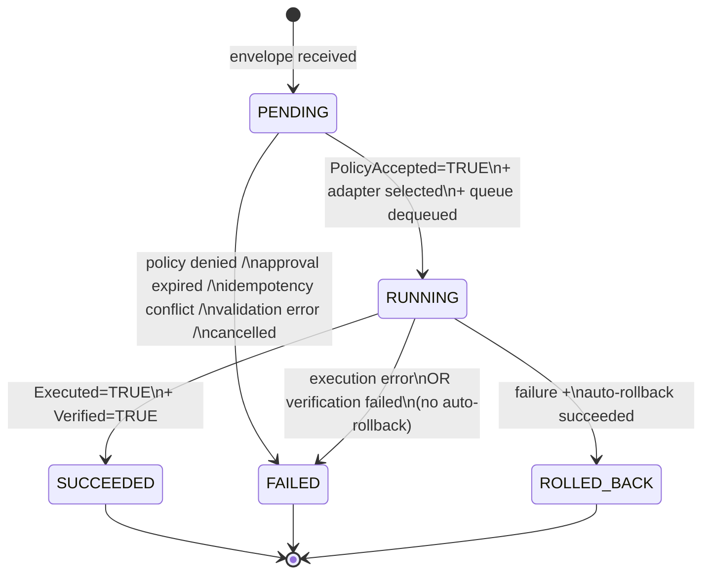

# Action Envelope + Lifecycle (Rev.2)

| Field          | Value                                                                                      |
| -------------- | ------------------------------------------------------------------------------------------ |
| Status         | `CONTRACT` (rev.2 design approved; awaiting implementation evidence)                       |
| Schema version | `aios.action.v1alpha1`                                                                     |
| Phase tag      | S0.1                                                                                       |
| Consumed by    | L3 (Capability Runtime), L4 (Policy Kernel client), L5 (Cognitive Core), L9 (Evidence Log) |
| Supersedes     | Rev.1 §13 — Typed Actions and Capability Runtime                                           |
| Approved       | 2026-05-07 (sections 1–9 walk-through)                                                     |

## 1. Purpose and scope

This contract defines the wire format, lifecycle, error model, versioning policy, gRPC interface, and surrounding cross-cutting concerns of typed actions in AIOS rev.2. It is the canonical refinement of [Rev.1 §13](../../001.AI-OS.NET--SPECREV.1/02_SPECIFICATION.md) and the foundation contract on which Phase 1 (Capability Translator, Latency Tiering, AIOS-FS conflict model) and Phase 2 (Policy Kernel, Verification grammar) build.

Scope option **B — Pragmatic+** was approved at brainstorming time. The contract addresses:

- Idempotency keys and retry semantics.
- Causality (parent action linkage; saga composition deferred).
- Formal result and error envelope schemas.
- Precise lifecycle state machine.
- Versioning policy for schema evolution.
- OpenTelemetry trace context handling.
- Sandbox profile binding.
- Dry-run / simulation mode.

Out of scope (deferred to other sub-specs):

- Subject identity canonical format → L4 `03_identity_model.md`.
- Saga / batching composition of actions → future cross-cutting sub-spec.
- Approval binding mechanics (delivery, UI, multi-channel) → L4 `04_approval_mechanics.md`.
- TTL / expiration policy on queued actions.
- Resource budget hints.

## 2. Top-level envelope structure

The envelope is partitioned into four logical sections at the proto level. Each section has a single owner of its mutations.

```proto
syntax = "proto3";
package aios.action.v1alpha1;

message ActionEnvelope {
  string schema_version = 1;       // canonical proto package; e.g. "aios.action.v1alpha1"
  Identity identity     = 2;       // immutable after creation; owned by caller
  Request request       = 3;       // immutable after creation; owned by caller
  Execution execution   = 4;       // mutates over lifecycle; owned by Capability Runtime
  TraceContext trace    = 5;       // transport metadata; set once
}
```

### 2.1. Section ownership and mutation

| Section     | Writer                             | Mutation cadence                         | Why separate                                                                                 |
| ----------- | ---------------------------------- | ---------------------------------------- | -------------------------------------------------------------------------------------------- |
| `identity`  | Caller                             | Never after creation                     | IDs must be stable across the lifecycle for deduplication, indexing, evidence linkage.       |
| `request`   | Caller                             | Never after creation                     | Approval is bound to the exact request hash; mutation invalidates approval.                  |
| `execution` | Capability Runtime                 | Frequent — each lifecycle transition     | Borrows the K8s `spec`/`status` separation: caller intent is distinct from observed reality. |
| `trace`     | Transport layer (gRPC interceptor) | Set once at edge; not mutated thereafter | OTel context is cross-cutting transport metadata; not envelope identity, not caller intent.  |

### 2.2. Envelope-level invariants

1. `identity` and `request` are **immutable** after `SubmitAction` returns. Capability Runtime rejects envelopes whose hashes drift from the originally accepted hash.
2. **Only `execution` mutates**, and only via well-defined transitions (Sec. 6).
3. `trace` may be populated post-creation by a gRPC interceptor if the caller did not set it. After first population, `trace_id` is stable.
4. **Wire format is proto.** JSON projection is for audit, evidence, and inspection. Wire-level integrity hashes are computed over proto deterministic bytes (Sec. 8).

## 3. Identity & idempotency

### 3.1. Proto IDL

```proto
import "google/protobuf/timestamp.proto";

message Identity {
  // Required, immutable
  string action_id        = 1;  // "act_<ULID>"; caller-generated; canonical identity
  string idempotency_key  = 2;  // caller-generated; opaque ≤128 chars; deduplication key
  google.protobuf.Timestamp created_at = 3;  // caller wall-clock at envelope creation

  // Contextual links (optional)
  string intent_id        = 4;  // "intent_<ULID>" — links to a user intent
  string plan_id          = 5;  // "plan_<ULID>"   — links to a multi-step plan
  string parent_action_id = 6;  // "act_<ULID>"    — single-parent causal link
  string correlation_id   = 7;  // free-form; groups across intents; defaults to action_id when unset
}
```

`subject` (who is asking) lives in `request`, not `identity`, because it describes caller intent rather than envelope identity.

### 3.2. ID format

All system-generated IDs use **ULID** (Crockford base32, 26 characters), prefix-namespaced:

| Prefix               | Semantics                            | Example                            |
| -------------------- | ------------------------------------ | ---------------------------------- |
| `act_`               | Action envelope                      | `act_01HXY8K2JPQ7N3M4R5S6T7V8W9`   |
| `intent_`            | User intent object                   | `intent_01HXY8K3...`               |
| `plan_`              | Multi-step plan                      | `plan_01HXY8K4...`                 |
| `corr_`              | Workflow correlation                 | `corr_01HXY8K5...`                 |
| `evr_`               | Evidence receipt (Sec. 5.5; L9 S3.1) | `evr_01HXZ9...`                    |
| `polreq_`, `poldec_` | Policy request / decision            | `polreq_01HX...`, `poldec_01HX...` |
| `appr_`              | Approval receipt                     | `appr_01HX...`                     |

ULID over UUID rationale:

- Lexicographically sortable, therefore chronologically sortable; large win for evidence log indexing.
- Encodes timestamp; "when was this generated" reads directly from the ID.
- 26 chars vs 36 for UUID; compactness in logs, JSON, proto wire format.
- Case-insensitive base32; URL-safe and copy-paste-safe.

### 3.3. Idempotency model

`idempotency_key` is a separate field from `action_id`, following the Stripe API convention.

| Field             | Role                                                | Generator                                                    |
| ----------------- | --------------------------------------------------- | ------------------------------------------------------------ |
| `action_id`       | Unique identity of the envelope in the evidence log | Caller — distinct per envelope                               |
| `idempotency_key` | Deduplication key for safe retries                  | Caller — same value across all retries of one logical action |

The four rules:

| Scenario                                               | Behavior                                                                                                                          |
| ------------------------------------------------------ | --------------------------------------------------------------------------------------------------------------------------------- |
| Same `idempotency_key` + **same** `hash(request)`      | Runtime returns the existing envelope at its current execution state without re-execution. Safe retry.                            |
| Same `idempotency_key` + **different** `hash(request)` | Runtime returns error `IdempotencyConflict`. Caller must use a different key.                                                     |
| Different `idempotency_key` + same content             | Treated as distinct logical actions. No deduplication.                                                                            |
| Same `idempotency_key` after **TTL expiry**            | Key forgotten; envelope treated as a new logical action. TTL = 24 hours by default; configurable per Capability Runtime instance. |

`hash(request)` = `BLAKE3(proto_deterministic_bytes(request))` (Sec. 8).

### 3.4. Causality model

`parent_action_id` links one action to the action that caused it.

1. If set, the runtime verifies the referenced ID exists in the evidence log before accepting the envelope.
2. **Cycle detection:** the runtime rejects envelopes that would create a cycle (DFS over the parent chain at receipt).
3. **Single-parent only.** Multi-parent (saga, fan-in) is deferred.
4. Causally linked actions inherit the `correlation_id` of their parent unless the caller overrides.

### 3.5. `correlation_id` vs `intent_id` vs `plan_id`

| Field            | Semantics                                                                 | Example                                                    |
| ---------------- | ------------------------------------------------------------------------- | ---------------------------------------------------------- |
| `intent_id`      | "I, the user, have this goal"                                             | "prepare a Rust dev environment"                           |
| `plan_id`        | "Cognitive Core's plan for this intent"                                   | a 7-step plan                                              |
| `correlation_id` | "This action belongs to this larger workflow" — may span multiple intents | "release v1.2.0" workflow with build, test, deploy intents |

`correlation_id` is broader than `intent_id`. One `correlation_id` may group actions from many intents; one `intent_id` cannot span multiple intents.

## 4. Request payload

What the caller wants done. Immutable after creation; the approval is bound to its hash.

### 4.1. Proto IDL

```proto
import "google/protobuf/struct.proto";

message Request {
  string action = 1;                             // dotted name; see §4.2
  google.protobuf.Struct target = 2;             // typed payload; schema per action (L3 adapter manifest)
  string subject = 3;                            // provisional format; canonical in L4 identity sub-spec
  string reason = 4;                             // required; ≤1024 chars; plain text
  Environment environment = 5;
  Risk risk = 6;
  repeated VerificationIntent verification = 7;  // grammar in L9 S2.4
  string sandbox_profile_id = 8;                 // optional; "" = runtime default
  DryRunMode dry_run = 9;                        // LIVE if unset
}

enum Environment {
  ENVIRONMENT_UNSPECIFIED = 0;
  LOCAL                   = 1;  // host-bounded operation
  LAN                     = 2;  // local network exposure expected
  INTERNET                = 3;  // public network exposure expected
  AIR_GAPPED              = 4;  // no external network
}

message Risk {
  bool destructive             = 1;  // modifies/deletes user data without rollback path
  bool privileged              = 2;  // requires elevated permissions
  bool network_exposure        = 3;  // opens a service or port beyond localhost
  bool secret_access           = 4;  // operates on secret material via Vault Broker
  bool recovery_path_affected  = 5;  // touches /, /root, kernel boot, or recovery partition
}

message VerificationIntent {
  string type = 1;                             // e.g. "service.active"; vocabulary in L9 S2.4
  google.protobuf.Struct args = 2;
}

enum DryRunMode {
  DRY_RUN_UNSPECIFIED = 0;
  LIVE                = 1;  // default if unset
  VALIDATE            = 2;  // schema/idempotency check only; no policy or execution
  SIMULATE            = 3;  // full path with sandboxed simulated execution; no committed side effects
}
```

### 4.2. `action` namespace convention

Dotted string `<domain>.<verb>` or `<domain>.<resource>.<verb>`. Domain is restricted to a fixed set:

| Domain      | Verb examples                                                        |
| ----------- | -------------------------------------------------------------------- |
| `service`   | `status`, `start`, `stop`, `restart`, `reload`, `enable`, `disable`  |
| `package`   | `install`, `remove`, `upgrade`, `query`                              |
| `process`   | `list`, `kill`, `signal`                                             |
| `network`   | `firewall.allow`, `firewall.deny`, `expose`, `unexpose`              |
| `aiosfs`    | `object.read`, `object.write`, `pointer.promote`, `pointer.rollback` |
| `repo`      | `clone`, `fetch`, `push`, `branch.create`                            |
| `container` | `pull`, `run`, `stop`, `remove`                                      |
| `secret`    | `use.ssh_key_for_git`, `use.api_token_for_http`, `rotate`            |
| `desktop`   | `notification.show`, `widget.refresh`                                |
| `verify`    | `service.active`, `port.open`, `http.ok`, ... (L9 S2.4)              |

The adapter (e.g. `systemd.local` for `service.*`) is a runtime selection by Capability Runtime, not part of the action name. The full action catalog comes from the union of adapter manifests (L3 `04_adapter_model.md`).

### 4.3. `target`

`google.protobuf.Struct` (typed JSON-like map) for flexibility per action. Type safety is restored at adapter level: each adapter manifest declares an expected target JSON Schema. Capability Runtime validates `target` against the adapter's schema before execution.

### 4.4. `subject` — provisional format

In the rev.2 envelope, `subject` is an opaque string. Recommended format: `<type>:<name>[/<sub_id>]`.

| Subject type    | Example                          |
| --------------- | -------------------------------- |
| Human           | `human:lucky`                    |
| Agent           | `agent:dev`, `agent:security`    |
| Application     | `application:org.aios.dashboard` |
| Service         | `service:nginx`                  |
| Device          | `device:tpm0`                    |
| Workflow        | `workflow:release_v1.2.0`        |
| Remote operator | `remote_operator:ops_team_lucky` |

Capability Runtime in rev.2 enforces only the regex shape `<type>:<name>(/<sub_id>)?`. Canonical validation, identity vault binding, and act-as policies are L4 sub-spec concerns.

### 4.5. `reason` — required

Empty `reason` causes envelope rejection with `MissingReason`. Approval prompts (KDE/Web/CLI) display `reason`; without it, approvals become uninformative. This is also a defensive measure against AI generating actions without explanation.

### 4.6. `environment` — enum

Fixed enum for stable policy authoring. Policy rules match enum values, not free-form strings.

### 4.7. `risk` — caller's claim, not authoritative

The five risk booleans are a caller declaration. They are **not authoritative**. Policy Kernel performs its own analysis and may override any field. Examples:

- Caller declares `destructive: false` for `aiosfs.pointer.rollback` ⇒ Policy Kernel treats as `destructive: true`.
- Caller declares `network_exposure: false` but adapter binds to `0.0.0.0` ⇒ Policy Kernel detects and treats as exposure.

Caller declaration serves two purposes:

- **Transparency** — high risk flags signal to the runtime that approval flow is likely needed.
- **Early validation** — if the declaration mismatches reality, Policy Kernel logs evidence of the mismatch.

### 4.8. `verification` — handoff to L9 S2.4

`verification` is a list of verification intents: what the caller expects to be verified after execution. The concrete grammar (types, args, composition) lives in L9 S2.4. The envelope merely carries the structure `{ type, args }`; runtime projects the results into `execution.verification_results`.

### 4.9. `sandbox_profile_id` — optional reference

Empty string ⇒ Capability Runtime selects the default profile for this action from the adapter manifest. Caller may specify a custom profile if sufficiently privileged. Profile content is defined in L6 S3.2. The Policy Kernel may override (toward more restrictive); `execution.applied_sandbox_profile_id` records what was actually applied.

### 4.10. `dry_run` modes

| Mode             | What runs                                                                                        | What does not               |
| ---------------- | ------------------------------------------------------------------------------------------------ | --------------------------- |
| `LIVE` (default) | Full lifecycle                                                                                   | —                           |
| `VALIDATE`       | Schema validation, idempotency check, target schema validation                                   | Policy, execution, evidence |
| `SIMULATE`       | Policy decision, sandboxed simulated execution, verification, evidence (marked `simulated=true`) | Production side effects     |

### 4.11. Example Request

```json
{
  "action": "service.restart",
  "target": { "service": "nginx" },
  "subject": "agent:dev",
  "reason": "Apply updated nginx vhost configuration after editing /aios/apps/nginx/conf/site.conf",
  "environment": "LOCAL",
  "risk": {
    "destructive": false,
    "privileged": true,
    "network_exposure": false,
    "secret_access": false,
    "recovery_path_affected": false
  },
  "verification": [
    { "type": "service.active", "args": { "service": "nginx" } },
    { "type": "http.ok", "args": { "url": "http://localhost/" } }
  ],
  "sandbox_profile_id": "",
  "dry_run": "LIVE"
}
```

## 5. Execution payload

What the runtime observes and records. Caller reads but does not write. Capability Runtime is the sole writer.

### 5.1. Proto IDL

```proto
import "google/protobuf/timestamp.proto";
import "google/protobuf/struct.proto";

message Execution {
  // Server-side intake
  google.protobuf.Timestamp received_at = 1;
  string capability_runtime_id = 2;

  // Coarse phase
  Phase phase = 3;
  google.protobuf.Timestamp phase_changed_at = 4;

  // Fine-grained state
  repeated Condition conditions = 5;

  // Policy and approval linkage
  string policy_decision_id = 6;                 // "poldec_<ULID>" — L4 record
  string approval_receipt_id = 7;                // "appr_<ULID>" — only if approval flow used

  // Adapter and execution
  string adapter_id = 8;                         // e.g. "systemd.local"
  uint32 attempts = 9;                           // increments per ExecuteAction call
  string applied_sandbox_profile_id = 10;        // possibly overridden by policy

  // Outcome — two independent optional fields; population rules per phase in §5.4
  Result result = 11;  // populated on SUCCEEDED; populated on ROLLED_BACK as rollback summary; otherwise unset
  Error  error  = 12;  // populated on FAILED; populated on ROLLED_BACK as the cause that triggered rollback; otherwise unset

  // Verification
  repeated VerificationResult verification_results = 13;

  // Evidence linkage (chronologically ordered)
  repeated string evidence_receipt_ids = 14;
}

enum Phase {
  PHASE_UNSPECIFIED = 0;
  PENDING           = 1;  // created; awaiting policy / approval / queue
  RUNNING           = 2;  // executing or verifying
  SUCCEEDED         = 3;  // terminal: executed AND verified
  FAILED            = 4;  // terminal: any failure path
  ROLLED_BACK       = 5;  // terminal: explicit rollback path completed
}

message Condition {
  string type = 1;
  ConditionStatus status = 2;
  google.protobuf.Timestamp last_transition_time = 3;
  string reason = 4;     // short machine-readable, e.g. "ScopedAllow"
  string message = 5;    // human-readable detail
}

enum ConditionStatus {
  CONDITION_STATUS_UNSPECIFIED = 0;
  CONDITION_TRUE    = 1;
  CONDITION_FALSE   = 2;
  CONDITION_UNKNOWN = 3;
}

message Result {
  string summary = 1;
  google.protobuf.Struct output = 2;
  string raw_output_ref = 3;
  bool changed = 4;
}

message VerificationResult {
  VerificationIntent intent = 1;       // self-contained copy
  VerificationStatus status = 2;
  string reason = 3;
  google.protobuf.Struct observed = 4;
  google.protobuf.Timestamp verified_at = 5;
}

enum VerificationStatus {
  VERIFICATION_STATUS_UNSPECIFIED = 0;
  VERIFICATION_PASSED   = 1;
  VERIFICATION_FAILED   = 2;
  VERIFICATION_TIMEOUT  = 3;
  VERIFICATION_SKIPPED  = 4;
}

// Error message defined in §7.
```

### 5.2. Phase semantics

Five buckets; the FSM in §6 governs transitions.

| Phase         | Semantics                                                                                                        |
| ------------- | ---------------------------------------------------------------------------------------------------------------- |
| `PENDING`     | Envelope accepted; awaiting policy / approval / queue.                                                           |
| `RUNNING`     | Adapter is executing or verification is running.                                                                 |
| `SUCCEEDED`   | Terminal: action executed and fully verified.                                                                    |
| `FAILED`      | Terminal: any failure (policy denial, execution error, verification failure, expiration).                        |
| `ROLLED_BACK` | Terminal: explicit rollback path completed. Distinct from `FAILED` because rollback can be a deliberate outcome. |

### 5.3. Canonical condition vocabulary

Conditions support multiple parallel facts with timestamps. Canonical types defined here; adapter-specific conditions are namespaced (`<adapter_id>.<TypeName>`).

| Type                  | Asserts                                              | Set when                       |
| --------------------- | ---------------------------------------------------- | ------------------------------ |
| `PolicyEvaluated`     | Policy Kernel returned a decision                    | After `EvaluatePolicy` returns |
| `PolicyAccepted`      | Decision was Allow or Approval-then-Allow            | After approval (if required)   |
| `ApprovalRequired`    | Policy required human approval                       | At approval prompt creation    |
| `ApprovalGranted`     | Approval was granted                                 | At grant                       |
| `ApprovalExpired`     | Approval TTL exceeded before execution               | At expiry                      |
| `Sandboxed`           | Execution ran inside a sandbox profile               | At execution start             |
| `Executed`            | Adapter completed execution                          | At execution end               |
| `Verified`            | All verification intents passed                      | At verification completion     |
| `RollbackPossible`    | Adapter registered a rollback target                 | At successful execution        |
| `RolledBack`          | Rollback completed                                   | At rollback completion         |
| `Idempotent`          | Request was deduplicated against an earlier envelope | At dedup detection             |
| `Simulated`           | Action ran in `SIMULATE` mode                        | At envelope receipt            |
| `DeprecatedFieldUsed` | Caller used a deprecated field (Sec. 8)              | At validation                  |

### 5.4. `Result` and `Error` — population rules

`result` and `error` are two **independent optional fields**, not a `oneof`. A `oneof` was considered and rejected because `ROLLED_BACK` legitimately needs both populated: the failure cause that triggered the rollback (`error`) and the rollback summary itself (`result`). Population rules are enforced by Capability Runtime in code, not by proto:

| Phase                | `result`                                                           | `error`                                       |
| -------------------- | ------------------------------------------------------------------ | --------------------------------------------- |
| `PENDING`, `RUNNING` | unset                                                              | unset                                         |
| `SUCCEEDED`          | populated (success summary)                                        | unset                                         |
| `FAILED`             | unset                                                              | populated (failure cause)                     |
| `ROLLED_BACK`        | populated (rollback summary; may be unset if rollback was a no-op) | populated (cause that triggered the rollback) |

### 5.5. Verification results

`verification_results[i]` corresponds to `request.verification[i]`. Sizes match when `phase = SUCCEEDED`. Each result carries a self-contained copy of its intent, eliminating back-references for evidence consumers.

### 5.6. Evidence linkage

`evidence_receipt_ids` is chronologically ordered. A typical successful action produces evidence receipts at:

```text
evr_...A — envelope received          (phase: PENDING)
evr_...B — policy decision recorded   (Condition PolicyEvaluated=TRUE)
evr_...C — approval granted (if any)  (Condition ApprovalGranted=TRUE)
evr_...D — execution started          (phase: RUNNING; Condition Sandboxed=TRUE)
evr_...E — execution completed        (Condition Executed=TRUE)
evr_...F — verification result        (Condition Verified=TRUE)
evr_...G — phase transitioned to SUCCEEDED
```

Evidence log architecture is detailed in L9 S3.1.

### 5.7. Mutation discipline

| Writer                       | Fields                                                                                                                             |
| ---------------------------- | ---------------------------------------------------------------------------------------------------------------------------------- |
| CR at receipt                | `received_at`, `capability_runtime_id`, initial `phase=PENDING`, empty `conditions`                                                |
| Policy Kernel client (in CR) | `policy_decision_id`, `approval_receipt_id`, conditions `PolicyEvaluated`, `PolicyAccepted`, `ApprovalRequired`, `ApprovalGranted` |
| Adapter (via CR)             | `adapter_id`, `attempts`, `applied_sandbox_profile_id`, conditions `Sandboxed`, `Executed`, `result`, `error`                      |
| Verification engine          | `verification_results[]`, condition `Verified`                                                                                     |
| Evidence projector           | `evidence_receipt_ids[]` (append-only)                                                                                             |

Cross-component writes flow through CR. No component writes the shared envelope state directly.

## 6. Lifecycle FSM

Phase-level FSM. Five phases, six transitions, three terminal states.

### 6.1. Diagram



### 6.2. Transitions table

| #   | From    | To          | Trigger                                        | Guards                                                                     | Effects                                                                                                            |
| --- | ------- | ----------- | ---------------------------------------------- | -------------------------------------------------------------------------- | ------------------------------------------------------------------------------------------------------------------ |
| T1  | (init)  | PENDING     | CR accepts envelope                            | Schema validation passes; idempotency check passes                         | Set `received_at`, `capability_runtime_id`; emit `envelope_received` evidence                                      |
| T2  | PENDING | FAILED      | Policy denied                                  | `PolicyEvaluated=TRUE` AND decision = DENY                                 | `error.code=PolicyDenied`; emit `policy_denial` evidence                                                           |
| T3  | PENDING | FAILED      | Approval expired                               | `ApprovalRequired=TRUE` AND TTL exceeded                                   | `error.code=ApprovalExpired`; condition `ApprovalExpired=TRUE`                                                     |
| T4  | PENDING | FAILED      | Idempotency conflict                           | Same `idempotency_key`, different `hash(request)`                          | `error.code=IdempotencyConflict`                                                                                   |
| T5  | PENDING | FAILED      | Cancelled before execution                     | External `action.cancel` accepted                                          | `error.code=Cancelled`                                                                                             |
| T6  | PENDING | RUNNING     | Policy accepted, adapter ready, queue dequeued | `PolicyAccepted=TRUE` AND `adapter_id` selected                            | `phase=RUNNING`, `attempts++`; condition `Sandboxed=TRUE` if applicable; emit `execution_started` evidence         |
| T7  | RUNNING | SUCCEEDED   | Action executed and verified                   | `Executed=TRUE` AND `Verified=TRUE`                                        | populate `result`; emit `execution_succeeded` evidence                                                             |
| T8  | RUNNING | FAILED      | Execution error, no rollback                   | Adapter error AND `RollbackPossible=FALSE` (or rollback skipped by policy) | populate `error`                                                                                                   |
| T9  | RUNNING | FAILED      | Verification failed, no rollback               | `Executed=TRUE` AND verification failed AND no rollback path               | `error.code=VerificationFailed`                                                                                    |
| T10 | RUNNING | ROLLED_BACK | Failure triggered auto-rollback that succeeded | (T8 or T9) AND `RollbackPossible=TRUE` AND rollback completed              | condition `RolledBack=TRUE`; populate `error` (cause) AND `result` (rollback summary); emit `rolled_back` evidence |

All transitions not listed here are forbidden. In particular, `SUCCEEDED → ROLLED_BACK` is **not** a valid transition; post-hoc rollback is a new envelope (§6.5).

### 6.3. Terminality invariant

Once `phase ∈ {SUCCEEDED, FAILED, ROLLED_BACK}`:

- No further phase transitions are allowed.
- No new conditions are added.
- No mutations to `result`, `error`, or `verification_results`.
- Late evidence receipts may append to `evidence_receipt_ids` for up to 1 hour after `phase_changed_at`. After that, the list is also frozen.

### 6.4. Retry semantics

Retries do not change phase.

- **Within PENDING:** re-receipt with the same `idempotency_key` and same `hash(request)` returns the existing envelope without incrementing `attempts`.
- **Within RUNNING:** if `ExecuteAction` returns an error with `error.retryable=true`, CR may retry. `attempts` increments per call. Bounded by retry budget (out of scope).

Retries never reset conditions or phase. Conditions update toward TRUE/FALSE/UNKNOWN with newer `last_transition_time`; they are never reset.

### 6.5. Cancellation and post-hoc rollback

Cancellation is itself an action (`action.cancel`), submitted as a new envelope. Its effect on the target envelope is one of T5, T8, or T10 depending on the phase at cancel time. Mechanics in a future cross-cutting sub-spec.

Post-hoc rollback (user wants to undo a successful action) is **not** a transition. It is a new envelope with `action = aiosfs.pointer.rollback` (or an action-specific rollback verb) and `parent_action_id` referencing the original. This preserves history.

### 6.6. Phase ↔ conditions consistency

`phase` is denormalized from `conditions[]`. Capability Runtime keeps both consistent:

```text
canonical phase = f(conditions):
  if Verified=TRUE  ∧ Executed=TRUE  ∧ ¬RolledBack         → SUCCEEDED
  if PolicyEvaluated=TRUE ∧ (PolicyDenied ∨ ApprovalExpired ∨ ApprovalDenied) → FAILED
  if Executed=FALSE ∧ error in PENDING context             → FAILED
  if Executed=TRUE  ∧ RolledBack=TRUE                      → ROLLED_BACK
  if Executed=TRUE  ∨ Sandboxed=TRUE ∨ Verifying           → RUNNING
  else                                                     → PENDING
```

`phase` is stored explicitly for fast indexing and renderer summaries. `conditions` carry detail.

### 6.7. Monotonicity invariants

- Phase is monotonic in terminality (non-terminal → terminal allowed; terminal → non-terminal forbidden).
- `phase_changed_at` is monotonically non-decreasing.
- Condition list grows; conditions are added, not removed.
- A condition's status may evolve `UNKNOWN → TRUE/FALSE` while non-terminal; once terminal, statuses are frozen.
- `attempts` is monotonically non-decreasing; never reset.

### 6.8. Single-writer principle

Capability Runtime is the **sole writer** of an envelope. Policy Kernel client, adapters, and verification engine submit changes to CR through internal APIs; CR serializes writes per envelope.

Distributed scenario: an envelope is owned by one CR instance (`capability_runtime_id`). Other CR instances may **read** but not write. Hand-over between instances is out of scope.

## 7. Error envelope

When `phase ∈ {FAILED, ROLLED_BACK}`, `outcome = error`. This section defines the formal structure, canonical taxonomy, and lifecycle mapping.

### 7.1. Proto IDL

```proto
message Error {
  string code = 1;                      // canonical code; PascalCase; see §7.3
  string message = 2;                   // English human-readable summary; ≤512 chars
  google.protobuf.Struct details = 3;   // structured details (code-specific)
  bool retryable = 4;                   // hint: safe to retry with same idempotency_key?
  Error cause = 5;                      // recursive; null at root; max depth 8
}
```

### 7.2. Naming convention

- **Canonical codes** (defined in this spec): PascalCase, no namespace. Examples: `PolicyDenied`, `VerificationFailed`, `IdempotencyConflict`.
- **Adapter-specific codes**: prefix-namespaced with adapter ID. Examples: `systemd.UnitNotFound`, `dnf.RepositoryUnreachable`.
- **Verification-specific codes**: prefix `verify.` (vocabulary in L9 S2.4).

### 7.3. Canonical error taxonomy

#### Validation (PENDING → FAILED, before policy)

| Code                       | When                                                     | Retryable |
| -------------------------- | -------------------------------------------------------- | --------- |
| `EnvelopeMalformed`        | Proto deserialization or schema validation failed        | `false`   |
| `MissingReason`            | `request.reason` empty                                   | `false`   |
| `InvalidActionName`        | `request.action` not in known namespace or format        | `false`   |
| `UnknownAdapter`           | No adapter handles this action                           | `false`   |
| `InvalidSubject`           | `request.subject` does not match `<type>:<name>` pattern | `false`   |
| `InvalidIdempotencyKey`    | Empty, too long (>128 chars), or invalid characters      | `false`   |
| `IdempotencyConflict`      | Same key, different `hash(request)`                      | `false`   |
| `SchemaVersionUnsupported` | `envelope.schema_version` not supported by CR            | `false`   |
| `TargetSchemaInvalid`      | `request.target` does not match adapter target schema    | `false`   |
| `SandboxProfileUnknown`    | `request.sandbox_profile_id` does not exist              | `false`   |

#### Policy

| Code                      | When                           | Retryable                                    |
| ------------------------- | ------------------------------ | -------------------------------------------- |
| `PolicyDenied`            | Policy Kernel returned `deny`  | `false`                                      |
| `ApprovalDenied`          | Human or agent denied approval | `false`                                      |
| `ApprovalExpired`         | TTL exceeded before grant      | `true` (new envelope with new approval flow) |
| `EmergencyLockout`        | Active emergency lockout       | `false`                                      |
| `PolicyKernelUnavailable` | CR cannot reach Policy Kernel  | `true`                                       |

#### Authorization / identity

| Code                     | When                                 | Retryable |
| ------------------------ | ------------------------------------ | --------- |
| `SubjectUnauthenticated` | Subject could not be authenticated   | `false`   |
| `SubjectUnauthorized`    | Subject lacks required capability    | `false`   |
| `SecretAccessDenied`     | Vault Broker denied secret operation | `false`   |

#### Execution (RUNNING → FAILED)

| Code                            | When                                                       | Retryable             |
| ------------------------------- | ---------------------------------------------------------- | --------------------- |
| `AdapterFailure`                | Adapter returned a generic error                           | depends on adapter    |
| `AdapterCrashed`                | Adapter process exited mid-execution                       | `true`                |
| `AdapterTimeout`                | Adapter exceeded execution timeout                         | `true`                |
| `AdapterDoesNotSupportSimulate` | `dry_run=SIMULATE` but adapter lacks `simulate` capability | `false`               |
| `SandboxViolation`              | Adapter attempted operation outside sandbox                | `false`               |
| `ResourceExhausted`             | OOM, disk full, handle exhaustion                          | `true` (after relief) |
| `Cancelled`                     | Explicit cancellation via `action.cancel`                  | `false`               |
| `Preempted`                     | System shutdown or higher-priority interrupt               | `true`                |

#### Verification

| Code                             | When                                    | Retryable |
| -------------------------------- | --------------------------------------- | --------- |
| `VerificationFailed`             | One or more verification intents failed | `false`   |
| `VerificationTimeout`            | Verification did not complete in time   | `true`    |
| `VerificationGrammarUnsupported` | Verification type not implemented       | `false`   |

#### Rollback

| Code                  | When                                                     | Retryable |
| --------------------- | -------------------------------------------------------- | --------- |
| `RollbackFailed`      | Rollback attempted but failed — system in degraded state | `false`   |
| `RollbackNotPossible` | No rollback path registered                              | `false`   |

#### Infrastructure

| Code                  | When                                    | Retryable |
| --------------------- | --------------------------------------- | --------- |
| `EvidenceWriteFailed` | Evidence log refused write              | `true`    |
| `RuntimeUnavailable`  | CR is degraded or restarting            | `true`    |
| `Internal`            | Unexpected CR bug; details in `details` | depends   |

### 7.4. `retryable` semantics

`retryable=true`: caller may safely retry with the same `idempotency_key` and expect a different result if the transient condition has cleared. Caller is responsible for back-off (exponential, jittered).

`retryable=false`: retry with the same key returns the same error. Caller must change request (new `idempotency_key`) or accept failure.

Only the originating component (CR or adapter) sets `retryable`. Wrapping errors in the cause chain do not override the root error's `retryable`.

### 7.5. Cause chain

Bounded depth of 8. Outermost error is the highest-level cause; `cause` is more specific. Example:

```json
{
  "code": "AdapterFailure",
  "message": "systemd adapter failed to restart nginx",
  "retryable": false,
  "cause": {
    "code": "SandboxViolation",
    "message": "adapter attempted secret read outside vault broker",
    "retryable": false,
    "cause": {
      "code": "SecretAccessDenied",
      "message": "vault broker policy denied raw read",
      "retryable": false,
      "cause": null
    }
  }
}
```

Renderers display the outermost message by default with a "Show details" toggle.

### 7.6. Localization

`message` is always English. Localization is a renderer-level concern, keyed off `code` (stable, language-neutral) and `details` (structured). Renderers maintain their own message catalogs.

`code` is stable across patch versions. `message` may be refined without a schema bump.

### 7.7. Error → terminal phase mapping

| Error code or group                                                     | Terminal phase        | Conditions                                                  |
| ----------------------------------------------------------------------- | --------------------- | ----------------------------------------------------------- |
| Validation errors                                                       | FAILED                | `PolicyEvaluated=UNKNOWN`                                   |
| `PolicyDenied`, `ApprovalDenied`, `ApprovalExpired`, `EmergencyLockout` | FAILED                | `PolicyEvaluated=TRUE`, `PolicyAccepted=FALSE`              |
| `Subject*` errors                                                       | FAILED                | depends on detection stage                                  |
| `Adapter*`, `Sandbox*`, `ResourceExhausted`, `Preempted`                | FAILED or ROLLED_BACK | `Sandboxed=TRUE`, `Executed=FALSE`                          |
| `Cancelled`                                                             | FAILED or ROLLED_BACK | depends on phase at cancel                                  |
| `Verification*`                                                         | FAILED or ROLLED_BACK | `Executed=TRUE`, `Verified=FALSE`                           |
| `RollbackFailed`                                                        | FAILED                | `Executed=TRUE`, `RolledBack=UNKNOWN` — **system degraded** |
| `RollbackNotPossible`                                                   | FAILED                | `Executed=TRUE`, `RollbackPossible=FALSE`                   |
| Infrastructure errors                                                   | FAILED                | depends on stage                                            |

`RollbackFailed` is the most dangerous error code. Capability Runtime emits a priority alert to the operator, and the envelope is marked with a `degraded_rollback=TRUE` indication in evidence (L9 S3.1).

### 7.8. Errors in `SIMULATE` mode

Errors produced under `dry_run=SIMULATE` carry the same structure but evidence receipts are marked `simulated=true` and do not trigger production alerts.

## 8. Versioning policy

### 8.1. Versioning scheme

Proto API versioning style (Kubernetes / Google Cloud API convention), not SemVer.

| Pattern                                 | Semantics                                                            |
| --------------------------------------- | -------------------------------------------------------------------- |
| `aios.action.v1alpha1`, `v1alpha2`, ... | Breaking changes allowed between alphas                              |
| `aios.action.v1beta1`, `v1beta2`, ...   | Feature-stable; non-trivial breaks allowed with deprecation warnings |
| `aios.action.v1`                        | Stable; only additive changes                                        |
| `aios.action.v2alpha1`, ...             | Start of next major; full break allowed vs `v1`                      |

This spec is `aios.action.v1alpha1`. Promotion to `v1beta1` requires:

- ≥1 working Capability Runtime implementation.
- Evidence from ≥100 successful actions in production-like environment.
- ≥2 adapters consuming the envelope without issues.

Promotion to `v1` requires production deployments, schema stable for ≥6 months without breaking changes, and multiple adapters and consumers.

### 8.2. Compatibility rules

#### Within `v1alphaN`

Anything may change. CR may reject envelopes from older alphas (`SchemaVersionUnsupported`).

#### Within `v1betaN → v1betaN+1`

Breaking changes allowed with:

- Deprecation warning in `details` of `v1betaN` responses for ≥1 version.
- Migration guide in release notes.
- CR supports both versions for ≥1 release cycle.

#### Within stable `v1`

Only additive changes:

| Change                 | Stable?                                     |
| ---------------------- | ------------------------------------------- |
| Add optional field     | ✅                                          |
| Add `oneof` variant    | ✅                                          |
| Add enum value         | ✅ (consumers must handle `*_UNSPECIFIED`)  |
| Add condition type     | ✅                                          |
| Add error code         | ✅                                          |
| Rename field           | ❌                                          |
| Remove field           | ❌ (mark `[deprecated=true]`, keep forever) |
| Change field type      | ❌                                          |
| Change field semantics | ❌                                          |
| Remove enum value      | ❌                                          |
| Remove error code      | ❌                                          |
| Required → optional    | ✅                                          |
| Optional → required    | ❌                                          |

#### `v1 → v2`

Full break allowed. CR supports both for ≥12 months. Migration tooling (envelope converter v1→v2) is mandatory.

### 8.3. CR version negotiation

```proto
message CapabilityRuntimeInfo {
  string runtime_id = 1;
  repeated string supported_schema_versions = 2;
  string default_schema_version = 3;
  string runtime_version = 4;
  repeated string supported_dry_run_modes = 5;
  google.protobuf.Timestamp started_at = 6;
}
```

Caller calls `GetCapabilityRuntimeInfo` once per session, caches the response, picks a schema version (default: highest stable available), and stamps every envelope with that version.

### 8.4. Deprecation policy

Deprecated fields, codes, and conditions are marked `[deprecated=true]` in proto. CR continues to accept them; submission with a deprecated field appends a `DeprecatedFieldUsed` condition with migration hint. Action proceeds normally. Deprecated items are never removed in stable.

### 8.5. Canonical encoding

The idempotency hash and evidence integrity hashes require deterministic encoding.

**Wire format:** proto3 deterministic serialization.

- Map keys serialized in lexicographic order.
- Repeated fields preserve declaration order.
- Default values omitted (proto3 default).
- No unknown fields (CR validates).

**JSON canonical form (for evidence inspection):** [JCS RFC 8785](https://www.rfc-editor.org/rfc/rfc8785). Lexicographic key order; no insignificant whitespace; normalized number representation; UTF-8 normalized strings. Applied at projection time, not on the wire.

**Hash algorithm:** [BLAKE3](https://github.com/BLAKE3-team/BLAKE3) (256-bit), hex-encoded in evidence.

Rationale: BLAKE3 is faster than SHA-256 (relevant on the hot path), cryptographically strong, and well-supported across Rust, Python, Go, TypeScript.

`hash(request)` = `BLAKE3(proto_deterministic_bytes(request))`.

### 8.6. Adapter version vs envelope version

Different concerns own different versioning:

| Concern                      | Owner                 |
| ---------------------------- | --------------------- |
| Envelope schema              | This spec             |
| Action target schema         | Adapter manifest (L3) |
| Adapter version              | Adapter manifest (L3) |
| Verification grammar version | L9 S2.4               |
| Policy package version       | L4                    |

The envelope carries identifiers for those other versions but does not define their versioning policies.

## 9. Cross-cutting: trace, sandbox, dry-run

### 9.1. TraceContext

```proto
message TraceContext {
  string trace_id     = 1;             // 32 hex chars; W3C trace-id; stable across lifecycle
  string span_id      = 2;             // 16 hex chars; caller's span (parent of CR-created spans)
  string trace_flags  = 3;             // 2 hex chars; W3C trace-flags
  string trace_state  = 4;             // W3C tracestate header value
  map<string, string> baggage = 5;     // W3C baggage propagation
}
```

Standard [W3C Trace Context](https://www.w3.org/TR/trace-context/). No AIOS-specific extensions.

#### Trace propagation rules

1. Set once at envelope creation (caller directly, or by CR's gRPC interceptor extracting W3C headers).
2. Child actions (set `parent_action_id`) inherit `trace_id` from parent by default; caller may override.
3. CR creates child spans for policy eval, execution, verification, sandbox setup; their structure is implementation detail.
4. Outgoing gRPC calls inject `envelope.trace` into gRPC metadata.

### 9.2. Sandbox profile resolution

Three sources may specify the profile. Resolution by maximum restriction:

```text
applied_sandbox_profile_id = max_restriction(
  policy_required,                     // L4 Policy Kernel decision
  caller_request,                      // request.sandbox_profile_id
  adapter_default                      // adapter manifest default
)
```

1. CR consults Policy Kernel for required/recommended profile.
2. If policy specifies, that wins (toward more restrictive only).
3. If policy is silent, caller's `sandbox_profile_id` is used.
4. If both unset, adapter default.
5. If all three unset and adapter has no default, **fail closed** with `SandboxProfileUnknown`.

`execution.applied_sandbox_profile_id` records what was actually applied. Sandbox is applied at T6 (PENDING → RUNNING). `Sandboxed=TRUE` is set on successful setup; setup failure → `SandboxViolation` and FAILED phase.

Profile content (capabilities, syscall filters, fs restrictions) lives in L6 S3.2.

### 9.3. Dry-run mode behavior

| Lifecycle stage            | `LIVE`        | `VALIDATE`                                  | `SIMULATE`                  |
| -------------------------- | ------------- | ------------------------------------------- | --------------------------- |
| Envelope schema validation | ✅            | ✅                                          | ✅                          |
| Idempotency check          | ✅            | ✅                                          | ✅                          |
| Target schema validation   | ✅            | ✅                                          | ✅                          |
| Policy evaluation          | ✅            | ❌                                          | ✅                          |
| Approval (if required)     | ✅            | ❌                                          | ✅ (real, not auto-approve) |
| Sandbox setup              | ✅            | ❌                                          | ✅                          |
| Adapter invocation         | ✅ live       | ❌                                          | ✅ simulate                 |
| Real side effects          | ✅            | ❌                                          | ❌ (shadow state)           |
| Verification               | ✅            | `VERIFICATION_SKIPPED`                      | ✅ against simulated state  |
| Evidence written           | ✅ production | optional, `simulated=true`                  | ✅ `simulated=true`         |
| Terminal phase             | normal        | SUCCEEDED if validation passed, else FAILED | normal                      |

#### Adapter `simulate` capability

`SIMULATE` mode requires the adapter to declare `simulate` in its capabilities (adapter manifest). If absent, CR returns `AdapterDoesNotSupportSimulate`.

Adapters handling destructive operations (`aiosfs.pointer.*`, `package.install`, `service.restart` with config changes) **must** support simulate. Pure-read adapters may omit it (LIVE without side effects is equivalent to SIMULATE).

#### `Simulated` condition and evidence interaction

When `dry_run=SIMULATE`, condition `Simulated=TRUE` is set at receipt. Evidence projector (L9) treats simulated entries as a separate stream; production audit reports may filter them out by default.

#### `VALIDATE` mode

Completes in ≤10ms typical. Policy Kernel **not** consulted. Phase transitions directly (init) → PENDING → SUCCEEDED (or FAILED on validation error). No `RUNNING` phase. Evidence not written by default; caller may opt in via a future extension flag.

### 9.4. Cross-cutting interactions

- **Trace + Dry-run:** in `SIMULATE`, baggage entry `aios.simulated="true"` is added automatically to outgoing gRPC metadata.
- **Sandbox + Dry-run:** in `SIMULATE`, sandbox is applied for real. Simulated execution still runs sandboxed because compromised adapters must not escape "because it's simulation".
- **Trace + Sandbox:** sandbox setup and teardown are spans (`sandbox.setup`, `sandbox.teardown`) under the envelope span.

### 9.5. Evidence linkage (preview)

Evidence receipts carry:

```json
{
  "receipt_id": "evr_...",
  "envelope_id": "act_...",
  "trace_id": "...",
  "applied_sandbox_profile_id": "...",
  "simulated": true
}
```

`trace_id` allows joining evidence log with distributed trace store. `simulated` is indexed for fast filtering. Full schema in L9 S3.1.

## 10. gRPC interface

Six RPCs replace rev.1's nine.

### 10.1. Diff from rev.1 §13

| Rev.1 RPC                          | Rev.2 status                                                      |
| ---------------------------------- | ----------------------------------------------------------------- |
| `ValidateAction`                   | Removed; use `SubmitAction(dry_run=VALIDATE)`                     |
| `EvaluatePolicy`                   | Removed; CR-internal (Policy Kernel has its own gRPC, L4)         |
| `RequestApproval`                  | Removed; CR-internal (L4 approval mechanics)                      |
| `ExecuteAction`                    | Renamed to `SubmitAction`                                         |
| `VerifyAction`                     | Removed; CR-internal (L9 verification engine)                     |
| `RollbackAction`                   | Removed; rollback is a new envelope (§6.5)                        |
| `GetActionStatus`                  | Renamed to `GetAction` (snapshot) + new `WatchAction` (streaming) |
| `ListAdapters`                     | Kept                                                              |
| `GetAdapterCapabilities`           | Kept                                                              |
| _(new)_ `GetCapabilityRuntimeInfo` | Added (§8.3)                                                      |

### 10.2. Service definition

```proto
syntax = "proto3";
package aios.action.v1alpha1;
import "google/protobuf/empty.proto";

service CapabilityRuntime {
  // Submit an envelope; CR orchestrates the full lifecycle. Behavior depends on request.dry_run.
  rpc SubmitAction(ActionEnvelope) returns (ActionEnvelope);

  // Server-streaming subscription to envelope updates.
  rpc WatchAction(WatchActionRequest) returns (stream ActionEnvelope);

  // Read-only snapshot.
  rpc GetAction(GetActionRequest) returns (ActionEnvelope);

  // Adapter discovery.
  rpc ListAdapters(ListAdaptersRequest) returns (AdapterList);
  rpc GetAdapterCapabilities(AdapterCapabilitiesRequest) returns (AdapterCapabilities);

  // Runtime info; version negotiation.
  rpc GetCapabilityRuntimeInfo(google.protobuf.Empty) returns (CapabilityRuntimeInfo);
}

message WatchActionRequest {
  string action_id = 1;
  bool include_history = 2;  // if true, replay past phase/condition changes before live updates
}

message GetActionRequest {
  string action_id = 1;
}

message ListAdaptersRequest {
  string action_filter = 1;  // optional; e.g. "service.*"
}

message AdapterList {
  repeated AdapterSummary adapters = 1;
}

message AdapterSummary {
  string adapter_id = 1;
  repeated string actions = 2;
  repeated string capabilities = 3;
}

message AdapterCapabilitiesRequest {
  string adapter_id = 1;
}

message AdapterCapabilities {
  string adapter_id = 1;
  string version = 2;
  repeated string actions = 3;
  repeated string capabilities = 4;
  google.protobuf.Struct target_schemas = 5;
  repeated string supported_sandbox_profiles = 6;
  repeated string emitted_error_codes = 7;
}
```

### 10.3. RPC semantics

#### `SubmitAction`

The single entry point.

- Caller fills `identity.action_id`, `identity.idempotency_key`, `identity.created_at`, `request.*`, optionally `trace.*`.
- CR fills `execution.*` and the rest of `trace.*`.
- Behavior by `dry_run`:
  - `LIVE`: CR blocks until terminal phase or client disconnect; returns full envelope.
  - `VALIDATE`: returns in milliseconds with envelope at SUCCEEDED or FAILED.
  - `SIMULATE`: full lifecycle with simulated execution; returns at terminal.
- Long-running actions with approval: callers should use `WatchAction` for streaming rather than blocking on `SubmitAction`. If the client disconnects before terminal, the lifecycle continues; the envelope remains query-able with `GetAction`.
- **Idempotent** at envelope level (§3.3) and at gRPC level: configure gRPC retry policy with `idempotency-level: idempotent` for safe re-sends.

#### `WatchAction`

Server-streaming. Pushes a fresh envelope snapshot on every phase change, condition update, or verification result. Closes when terminal phase is reached. If `include_history=true`, replays past states from the evidence log first.

#### `GetAction`

Single-shot snapshot. `NOT_FOUND` if `action_id` was never submitted.

#### `ListAdapters` / `GetAdapterCapabilities`

Discovery. Used by L5 Capability Translator and by tooling.

#### `GetCapabilityRuntimeInfo`

Version negotiation entry point. Cache once per session.

### 10.4. Idempotency at gRPC level

`SubmitAction` is idempotent at envelope level. gRPC retry policies (configurable client-side) may re-send `SubmitAction` on transient network errors; CR detects duplicates and returns the existing envelope without re-execution. Configure with gRPC's `idempotency-level: idempotent` annotation.

### 10.5. Error model — gRPC status vs envelope phase

| Type                         | When                                        | Where to look                       |
| ---------------------------- | ------------------------------------------- | ----------------------------------- |
| **gRPC-level** (status ≠ OK) | CR cannot accept envelope                   | gRPC status code + status details   |
| **Envelope-level FAILED**    | Envelope accepted; lifecycle reached FAILED | Envelope: `phase=FAILED`, `error.*` |

Concrete mapping:

| Validation                   | gRPC status                                        |
| ---------------------------- | -------------------------------------------------- |
| Proto deserialization fail   | `INVALID_ARGUMENT`                                 |
| `schema_version` unsupported | `FAILED_PRECONDITION`                              |
| Subject cert mismatch        | `UNAUTHENTICATED` or `PERMISSION_DENIED`           |
| CR degraded                  | `UNAVAILABLE` (caller should retry)                |
| Successful submission        | `OK` (envelope in response; `phase` shows outcome) |

### 10.6. Auth and identity binding

CR enforces subject-cert binding:

- gRPC mTLS client cert identifies the connection peer.
- `request.subject` must match the cert, or the peer must be authorized to act-as the subject (act-as policy in L4).
- Mismatch ⇒ `PERMISSION_DENIED`; envelope not accepted.

Canonical subject authorization is L4's concern. The envelope is merely a carrier for `subject`.

### 10.7. Migration from rev.1

| Rev.1 caller pattern                                                  | Rev.2 equivalent                                                                                          |
| --------------------------------------------------------------------- | --------------------------------------------------------------------------------------------------------- |
| `ValidateAction(env)`                                                 | `SubmitAction(env, dry_run=VALIDATE)`                                                                     |
| `Validate → EvaluatePolicy → Execute → Verify` (caller orchestration) | `SubmitAction(env)` (CR orchestrates)                                                                     |
| `RequestApproval`                                                     | implicit; CR emits prompt via L4                                                                          |
| `RollbackAction(action_id)`                                           | `SubmitAction(rollback_envelope)` with `action="aiosfs.pointer.rollback"` and `parent_action_id=original` |
| `GetActionStatus(id)` poll loop                                       | `WatchAction(id)` streaming                                                                               |
| `GetActionStatus(id)` single                                          | `GetAction(id)`                                                                                           |

## 11. Open invariants (consolidated)

Items deferred to other sub-specs:

- Subject canonical format and act-as policies → L4 `03_identity_model.md`.
- Approval delivery, prompt UI, multi-channel → L4 `04_approval_mechanics.md`.
- Adapter manifest schema (capabilities, target schemas, error codes) → L3 `04_adapter_model.md`.
- Sandbox profile content and the `max_restriction` algorithm → L6 S3.2.
- Verification grammar (vocabulary, composition, semantics) → L9 S2.4.
- Evidence log architecture (WAL, segments, tiering, indexes) → L9 S3.1.
- Cancellation mechanics → future cross-cutting sub-spec.
- Saga / multi-parent action composition → future cross-cutting sub-spec.
- Action TTL / expiration policy → future runtime sub-spec.
- Resource budget hints → future runtime sub-spec.
- mTLS cert provisioning workflow → L4 vault sub-spec.

## 12. References

- [Rev.1 §13 — Typed Actions and Capability Runtime](../../001.AI-OS.NET--SPECREV.1/02_SPECIFICATION.md)
- [W3C Trace Context](https://www.w3.org/TR/trace-context/)
- [BLAKE3 specification](https://github.com/BLAKE3-team/BLAKE3-specs)
- [JCS RFC 8785 (JSON Canonicalization Scheme)](https://www.rfc-editor.org/rfc/rfc8785)
- [Stripe Idempotency](https://stripe.com/docs/api/idempotent_requests)
- [Kubernetes API conventions — Resource Versioning](https://github.com/kubernetes/community/blob/master/contributors/devel/sig-architecture/api_conventions.md)

## Appendix A: Complete proto IDL

```proto
syntax = "proto3";
package aios.action.v1alpha1;

import "google/protobuf/timestamp.proto";
import "google/protobuf/struct.proto";
import "google/protobuf/empty.proto";

// ─────────────────────────────────────────────────────────────────
// Top-level envelope
// ─────────────────────────────────────────────────────────────────

message ActionEnvelope {
  string schema_version = 1;
  Identity identity     = 2;
  Request request       = 3;
  Execution execution   = 4;
  TraceContext trace    = 5;
}

// ─────────────────────────────────────────────────────────────────
// Identity
// ─────────────────────────────────────────────────────────────────

message Identity {
  string action_id        = 1;
  string idempotency_key  = 2;
  google.protobuf.Timestamp created_at = 3;
  string intent_id        = 4;
  string plan_id          = 5;
  string parent_action_id = 6;
  string correlation_id   = 7;
}

// ─────────────────────────────────────────────────────────────────
// Request
// ─────────────────────────────────────────────────────────────────

message Request {
  string action = 1;
  google.protobuf.Struct target = 2;
  string subject = 3;
  string reason = 4;
  Environment environment = 5;
  Risk risk = 6;
  repeated VerificationIntent verification = 7;
  string sandbox_profile_id = 8;
  DryRunMode dry_run = 9;
}

enum Environment {
  ENVIRONMENT_UNSPECIFIED = 0;
  LOCAL                   = 1;
  LAN                     = 2;
  INTERNET                = 3;
  AIR_GAPPED              = 4;
}

message Risk {
  bool destructive             = 1;
  bool privileged              = 2;
  bool network_exposure        = 3;
  bool secret_access           = 4;
  bool recovery_path_affected  = 5;
}

message VerificationIntent {
  string type = 1;
  google.protobuf.Struct args = 2;
}

enum DryRunMode {
  DRY_RUN_UNSPECIFIED = 0;
  LIVE                = 1;
  VALIDATE            = 2;
  SIMULATE            = 3;
}

// ─────────────────────────────────────────────────────────────────
// Execution
// ─────────────────────────────────────────────────────────────────

message Execution {
  google.protobuf.Timestamp received_at = 1;
  string capability_runtime_id = 2;

  Phase phase = 3;
  google.protobuf.Timestamp phase_changed_at = 4;

  repeated Condition conditions = 5;

  string policy_decision_id = 6;
  string approval_receipt_id = 7;

  string adapter_id = 8;
  uint32 attempts = 9;
  string applied_sandbox_profile_id = 10;

  Result result = 11;
  Error  error  = 12;

  repeated VerificationResult verification_results = 13;
  repeated string evidence_receipt_ids = 14;
}

enum Phase {
  PHASE_UNSPECIFIED = 0;
  PENDING           = 1;
  RUNNING           = 2;
  SUCCEEDED         = 3;
  FAILED            = 4;
  ROLLED_BACK       = 5;
}

message Condition {
  string type = 1;
  ConditionStatus status = 2;
  google.protobuf.Timestamp last_transition_time = 3;
  string reason = 4;
  string message = 5;
}

enum ConditionStatus {
  CONDITION_STATUS_UNSPECIFIED = 0;
  CONDITION_TRUE    = 1;
  CONDITION_FALSE   = 2;
  CONDITION_UNKNOWN = 3;
}

message Result {
  string summary = 1;
  google.protobuf.Struct output = 2;
  string raw_output_ref = 3;
  bool changed = 4;
}

message VerificationResult {
  VerificationIntent intent = 1;
  VerificationStatus status = 2;
  string reason = 3;
  google.protobuf.Struct observed = 4;
  google.protobuf.Timestamp verified_at = 5;
}

enum VerificationStatus {
  VERIFICATION_STATUS_UNSPECIFIED = 0;
  VERIFICATION_PASSED   = 1;
  VERIFICATION_FAILED   = 2;
  VERIFICATION_TIMEOUT  = 3;
  VERIFICATION_SKIPPED  = 4;
}

message Error {
  string code = 1;
  string message = 2;
  google.protobuf.Struct details = 3;
  bool retryable = 4;
  Error cause = 5;
}

// ─────────────────────────────────────────────────────────────────
// Trace
// ─────────────────────────────────────────────────────────────────

message TraceContext {
  string trace_id     = 1;
  string span_id      = 2;
  string trace_flags  = 3;
  string trace_state  = 4;
  map<string, string> baggage = 5;
}

// ─────────────────────────────────────────────────────────────────
// Capability Runtime service
// ─────────────────────────────────────────────────────────────────

service CapabilityRuntime {
  rpc SubmitAction(ActionEnvelope) returns (ActionEnvelope);
  rpc WatchAction(WatchActionRequest) returns (stream ActionEnvelope);
  rpc GetAction(GetActionRequest) returns (ActionEnvelope);
  rpc ListAdapters(ListAdaptersRequest) returns (AdapterList);
  rpc GetAdapterCapabilities(AdapterCapabilitiesRequest) returns (AdapterCapabilities);
  rpc GetCapabilityRuntimeInfo(google.protobuf.Empty) returns (CapabilityRuntimeInfo);
}

message WatchActionRequest {
  string action_id = 1;
  bool include_history = 2;
}

message GetActionRequest {
  string action_id = 1;
}

message ListAdaptersRequest {
  string action_filter = 1;
}

message AdapterList {
  repeated AdapterSummary adapters = 1;
}

message AdapterSummary {
  string adapter_id = 1;
  repeated string actions = 2;
  repeated string capabilities = 3;
}

message AdapterCapabilitiesRequest {
  string adapter_id = 1;
}

message AdapterCapabilities {
  string adapter_id = 1;
  string version = 2;
  repeated string actions = 3;
  repeated string capabilities = 4;
  google.protobuf.Struct target_schemas = 5;
  repeated string supported_sandbox_profiles = 6;
  repeated string emitted_error_codes = 7;
}

message CapabilityRuntimeInfo {
  string runtime_id = 1;
  repeated string supported_schema_versions = 2;
  string default_schema_version = 3;
  string runtime_version = 4;
  repeated string supported_dry_run_modes = 5;
  google.protobuf.Timestamp started_at = 6;
}
```

## Appendix B: Example envelope evolutions

### B.1. Successful action (LIVE)

T1 — caller submits:

```json
{
  "schema_version": "aios.action.v1alpha1",
  "identity": {
    "action_id": "act_01HXY8K2JPQ7N3M4R5S6T7V8W9",
    "idempotency_key": "client-abc-restart-nginx-20260507",
    "created_at": "2026-05-07T13:15:00.000Z",
    "intent_id": "intent_01HXY8K3...",
    "plan_id": "plan_01HXY8K4..."
  },
  "request": {
    "action": "service.restart",
    "target": { "service": "nginx" },
    "subject": "agent:dev",
    "reason": "Apply updated nginx vhost config",
    "environment": "LOCAL",
    "risk": { "privileged": true },
    "verification": [
      { "type": "service.active", "args": { "service": "nginx" } }
    ],
    "dry_run": "LIVE"
  },
  "execution": {
    "received_at": "2026-05-07T13:15:00.100Z",
    "capability_runtime_id": "cr_local_01",
    "phase": "PENDING",
    "phase_changed_at": "2026-05-07T13:15:00.100Z",
    "conditions": [],
    "attempts": 0,
    "evidence_receipt_ids": ["evr_01HX...A"]
  },
  "trace": {
    "trace_id": "0af7651916cd43dd8448eb211c80319c",
    "span_id": "b7ad6b7169203331"
  }
}
```

T4 — terminal SUCCEEDED:

```json
{
  ...,
  "execution": {
    ...,
    "phase": "SUCCEEDED",
    "phase_changed_at": "2026-05-07T13:15:04.500Z",
    "policy_decision_id": "poldec_01HX...B",
    "approval_receipt_id": "appr_01HX...C",
    "adapter_id": "systemd.local",
    "applied_sandbox_profile_id": "service_restart_default",
    "attempts": 1,
    "result": { "summary": "nginx restarted", "output": { "previous_pid": 12345, "new_pid": 12678 }, "changed": true },
    "verification_results": [ { "intent": { "type": "service.active", "args": { "service": "nginx" } }, "status": "VERIFICATION_PASSED", "reason": "Active", "observed": { "state": "active" }, "verified_at": "2026-05-07T13:15:04.500Z" } ],
    "conditions": [
      { "type": "PolicyEvaluated",   "status": "TRUE", "last_transition_time": "T2",   "reason": "ScopedRule" },
      { "type": "ApprovalRequired",  "status": "TRUE", "last_transition_time": "T2",   "reason": "PolicyObligation" },
      { "type": "ApprovalGranted",   "status": "TRUE", "last_transition_time": "T3",   "reason": "HumanLocalOperator" },
      { "type": "Sandboxed",         "status": "TRUE", "last_transition_time": "T3",   "reason": "ProfileApplied" },
      { "type": "Executed",          "status": "TRUE", "last_transition_time": "T4-2s","reason": "AdapterReturned" },
      { "type": "Verified",          "status": "TRUE", "last_transition_time": "T4",   "reason": "AllIntentsPassed" },
      { "type": "RollbackPossible",  "status": "TRUE", "last_transition_time": "T4-2s","reason": "PreviousArtifactPresent" }
    ],
    "evidence_receipt_ids": ["evr_...A","evr_...B","evr_...C","evr_...D","evr_...E","evr_...F","evr_...G"]
  }
}
```

### B.2. Action denied by policy

```json
"execution": {
  "phase": "FAILED",
  "policy_decision_id": "poldec_...",
  "conditions": [
    { "type": "PolicyEvaluated", "status": "TRUE",  "reason": "EmergencyLockout" },
    { "type": "PolicyAccepted",  "status": "FALSE", "reason": "EmergencyLockout" }
  ],
  "error": {
    "code": "EmergencyLockout",
    "message": "Action denied: emergency lockout active until 2026-05-07T14:00:00Z",
    "retryable": false
  }
}
```

### B.3. SIMULATE example

```json
"request": { ..., "dry_run": "SIMULATE" },
"execution": {
  "phase": "SUCCEEDED",
  "conditions": [
    { "type": "Simulated",       "status": "TRUE" },
    { "type": "PolicyEvaluated", "status": "TRUE" },
    { "type": "PolicyAccepted",  "status": "TRUE" },
    { "type": "Sandboxed",       "status": "TRUE" },
    { "type": "Executed",        "status": "TRUE", "reason": "AdapterSimulateReturned" },
    { "type": "Verified",        "status": "TRUE", "reason": "AllIntentsPassedAgainstShadowState" }
  ],
  "result": { "summary": "[SIMULATED] nginx would have been restarted", "changed": false },
  "evidence_receipt_ids": ["evr_..._sim_A", "evr_..._sim_B", "..."]
}
```

The `evidence_receipt_ids` belong to the simulated stream of the evidence log; production audit views filter them out by default.
